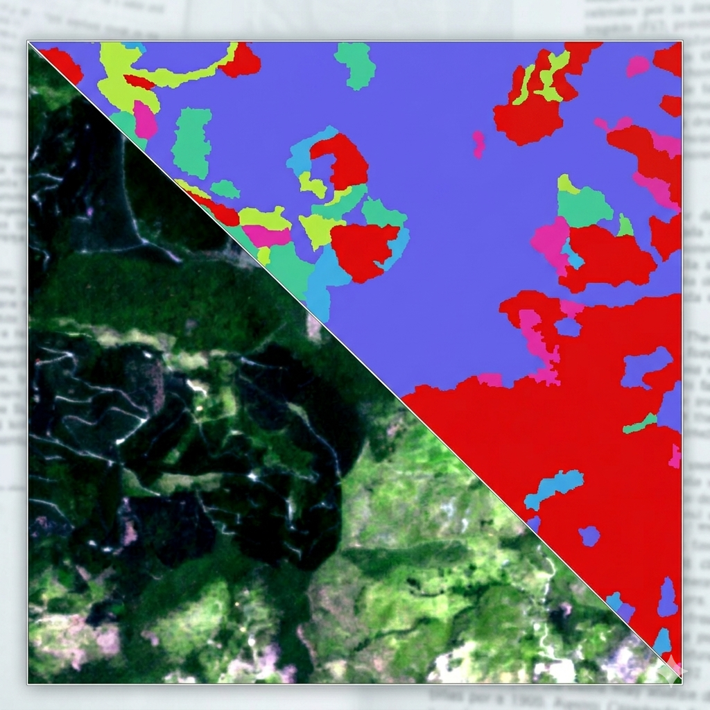

# Satellite Segmentation Framework

Framework de segmentação semântica para imagens de satélite multiespectrais (11 bandas), comparando duas arquiteturas:

- **Prithvi**: Foundation model geoespacial IBM/NASA (ViT-Base, 100M parâmetros, pré-treinado em dados HLS)
- **AttentionResUNet**: Encoder ResNet34 + decoder com attention gates espaciais e de canal

Ambos os modelos foram treinados sobre imagens 1024×1024 com 19 classes de uso e cobertura do solo.



---

## Sumário

1. [Arquitetura do Projeto](#arquitetura-do-projeto)
2. [Setup — Windows (venv)](#setup--windows-venv)
3. [Setup — Docker](#setup--docker)
4. [Pipeline de Dados](#pipeline-de-dados)
5. [Treinamento](#treinamento)
6. [Inferência](#inferência)
7. [Exportação de Modelos](#exportação-de-modelos)
8. [Estrutura de Diretórios](#estrutura-de-diretórios)
9. [Configurações](#configurações)
10. [Métricas e Monitoramento](#métricas-e-monitoramento)

---

## Arquitetura do Projeto

```
SatSegmentation/
├── config/
│   ├── prithvi.yaml          # Hiperparâmetros do Prithvi
│   └── unet.yaml             # Hiperparâmetros do U-Net
├── scripts/
│   ├── prithvi/
│   │   ├── train_prithvi.py  # Loop de treino Prithvi
│   │   ├── predict_prithvi.py# Inferência em batch (TorchScript FP16)
│   │   └── prithvi_fp16.py   # Conversão para FP16 + TorchScript
│   └── unet/
│       ├── train_unet.py     # Loop de treino U-Net
│       ├── predict_unet.py   # Inferência ONNX com tiling e overlap
│       └── export_onnx_unet.py
├── src/
│   ├── model.py              # AttentionResUNet + Prithvi11BandsModel
│   ├── dataset.py            # SegDatasetMemmap, PrithviDataset, augmentação GPU
│   ├── metrics.py            # FocalDiceLoss, mIoU, Dice, Kappa, plots
│   ├── utils.py              # Pesos de classe, avaliação, file pairing
│   ├── checkpoint_model.py   # Save/load de estado completo de treino
│   ├── eval.py               # Loop de validação com CSV + confusion matrix
│   └── fix_terratorch.py     # Patch de instalação do TerraTorch (one-time)
├── data/
│   ├── Images/               # GeoTIFFs de entrada (11 bandas)
│   └── Labels/               # Máscaras de segmentação (*_mask.tif)
└── memmap_output/            # Dados pré-processados (gerado automaticamente)
```

---

## Setup — Windows (venv)

```powershell
git clone https://github.com/Ga0512/SatSegmentation.git
cd SatSegmentation

python -m venv venv
venv\Scripts\activate

python -m pip install --upgrade pip
pip install torch torchvision torchaudio --index-url https://download.pytorch.org/whl/cu121
pip install -r requirements.txt
```

**Patch obrigatório (executar uma única vez após instalar):**
```powershell
python -m src.fix_terratorch
```

**Variável de ambiente para rasterio (necessária em toda sessão):**
```powershell
$env:PROJ_LIB = "$pwd\venv\Lib\site-packages\rasterio\proj_data"
```

---

## Setup — Docker

### Pré-requisitos

- Docker
- NVIDIA Container Toolkit (para acesso à GPU dentro do container)

```bash
sudo apt-get update && sudo apt-get install -y nvidia-container-toolkit
sudo systemctl restart docker

# Verificar acesso à GPU
docker run --rm --gpus all nvidia/cuda:12.1.1-base-ubuntu22.04 nvidia-smi
```

### Build e execução

```bash
docker build -t satseg .
docker run -it --gpus all -v ${PWD}:/app satseg
```

Dentro do container:
```bash
python -m src.fix_terratorch
```

---

## Pipeline de Dados

O pipeline transforma GeoTIFFs brutos em arquivos memory-mapped binários (`.dat`) para carregamento eficiente durante o treino.

### Fluxo

```
GeoTIFFs (./data/) → build_memmap_and_stats() → ./memmap_output/*.dat + stats.npz
                                                              ↓
                                               SegDatasetMemmap / PrithviDataset
                                                              ↓
                                               DataLoader (workers CPU, pin_memory)
                                                              ↓
                                               Normalização na GPU (clamp + z-score)
                                                              ↓
                                               Augmentação GPU (Kornia)
```

### Detalhes técnicos

- Imagens armazenadas como `uint16` (2 bytes/pixel), máscaras como `int16`
- Crops de 512×512 extraídos de forma não-sobreposta das imagens 1024×1024
- Estatísticas por banda (percentis p2/p98, média, desvio padrão) calculadas uma única vez e salvas em `stats.npz`
- **Normalização executada na GPU** (clamp percentílico + z-score por banda) — os workers de CPU fazem apenas leitura e cast de tipo
- A construção do memmap é automática na primeira execução do treino; execuções subsequentes reutilizam os arquivos existentes

---

## Treinamento

### Prithvi

```bash
python -m scripts.prithvi.train_prithvi --config config/prithvi.yaml

# Retomar de checkpoint
python -m scripts.prithvi.train_prithvi --config config/prithvi.yaml --resume
python -m scripts.prithvi.train_prithvi --config config/prithvi.yaml --resume path/to/checkpoint.pth
```

**Características do loop:**
- Mixed precision (AMP FP16) com gradient clipping (`max_norm=1.0`)
- Scheduler: Linear warmup (5 épocas, 1% → 100% do LR) + Cosine Annealing
- Loss: `CrossEntropyLoss` com `class_weights` (log-inverso de frequência) e `ignore_index=0`
- Métricas: `JaccardIndex` e `Accuracy` via TorchMetrics (ignoram background)
- Checkpoint salvo quando `val_loss` melhora; early stopping com `patience=30`

### AttentionResUNet

```bash
python -m scripts.unet.train_unet --config config/unet.yaml
```

**Características do loop:**
- Mixed precision (AMP FP16) com gradient accumulation (effective batch = `batch_size × grad_accum`)
- Scheduler: Cosine Annealing
- Loss: `FocalDiceLoss` com `class_weights`, `ignore_index=0` — background excluído tanto da Focal quanto do Dice
- Augmentação GPU via Kornia: flip, rotação 90°, brilho/contraste, affine, blur gaussiano
- `torch.channels_last` no modelo para melhor throughput em GPUs com Tensor Cores

### Pesos de classe

Calculados automaticamente por `compute_class_weights()`:
- Frequência inversa com suavização logarítmica: `w = log(1 / (freq + 1e-8))`
- Clipping em `[0.2, 10.0]` para evitar pesos extremos
- Background (classe 0) recebe peso `0.0` — tratado via `ignore_index` na loss
- Normalizados para média 1.0 sobre as classes ativas

---

## Inferência

### Prithvi (TorchScript FP16)

```bash
python -m scripts.prithvi.predict_prithvi
```

- Carrega modelo TorchScript em FP16 de `./model/prithvi_production_fp16.pt`
- Processa múltiplas imagens em batch cross-image (sem recarregar o modelo entre arquivos)
- Normalização z-score por banda na GPU antes da inferência
- Saída: GeoTIFF com máscara de classes em `./predicoes/`

### AttentionResUNet (ONNX Runtime)

```bash
python -m scripts.unet.predict_unet
```

- Inferência via ONNX Runtime com `CUDAExecutionProvider`
- Tiling com overlap de 128px e média ponderada por mapa gaussiano centrado (elimina artefatos de borda)
- Normalização clamp + z-score na GPU antes de cada batch
- Saída: GeoTIFF comprimido (LZW, tiled) em `./Masks/`

---

## Exportação de Modelos

### Prithvi → FP16 TorchScript

```bash
python -m scripts.prithvi.prithvi_fp16
```

Gera dois artefatos:
- `./model/best_prithvi_11bands_fp16.pth` — state dict em FP16
- `./model/prithvi_production_fp16.pt` — TorchScript standalone (sem dependência de `src/`)

### AttentionResUNet → ONNX

```bash
python -m scripts.unet.export_onnx_unet
```

---

## Estrutura de Diretórios

| Diretório | Conteúdo |
|---|---|
| `./data/Images/` | GeoTIFFs de entrada (11 bandas, 1024×1024) |
| `./data/Labels/` | Máscaras `*_mask.tif` (19 classes) |
| `./memmap_output/` | `*.dat` + `stats.npz` (gerado automaticamente) |
| `./model/` | Pesos Prithvi (`.pth`, FP16 `.pt`) |
| `./output/` | Melhor checkpoint U-Net, CSV de validação, confusion matrix |
| `./metrics_prithvi/` | Curvas de treino do Prithvi (PNG) |
| `./metrics_unet/` | Curvas de treino do U-Net (PNG) |
| `./predicoes/` | GeoTIFFs de saída da inferência Prithvi |
| `./Masks/` | GeoTIFFs de saída da inferência U-Net |

---

## Configurações

### `config/prithvi.yaml`

```yaml
dataset:
  img_size: [1024, 1024]
  crop_size: 512
  num_bands: 11
  num_classes: 19
  val_size: 0.20        # 80/20 split
  num_cores: 4          # workers do DataLoader

training:
  epochs: 60
  patience: 30          # early stopping
  learning_rate: 5e-5
  batch_size: 8
  weight_decay: 0.01
```

### `config/unet.yaml`

```yaml
dataset:
  img_size: [1024, 1024]
  crop_size: 512
  num_bands: 11
  num_classes: 19
  val_size: 0.25        # 75/25 split
  num_cores: 4

training:
  epochs: 25
  patience: 10
  learning_rate: 5e-5
  batch_size: 8
  grad_accum: 2         # effective batch = 16
```

---

## Métricas e Monitoramento

A cada época são registrados e plotados:

| Métrica | Descrição |
|---|---|
| `train_loss` / `val_loss` | Loss média por época |
| `val_miou` | mIoU excluindo background (classes 1–18) |
| `val_acc` | Pixel accuracy excluindo background |
| `lr` | Learning rate atual |
| `time` | Tempo de execução por época (s) |
| `gpu_mem` | Pico de memória GPU alocada (GB) |

Gráficos salvos em `./metrics_prithvi/` e `./metrics_unet/` após cada época.

Ao final do treino, `evaluate_model()` gera:
- CSV com precision, recall, F1, IoU e Dice por classe
- Confusion matrix em PNG
- Kappa de Cohen e Weighted IoU globais

### Notas de implementação

- **`src/fix_terratorch.py`** deve ser executado uma vez após a instalação — corrige a constante `SENTINEL2_ALL_SOFTCON → SENTINEL2_ALL_MOCO` na biblioteca TerraTorch instalada
- Todos os scripts são invocados como módulos (`python -m scripts.X.Y`), não diretamente
- O Prithvi estende o patch embedding pré-treinado de 6 para 11 bandas: os 6 canais HLS originais são copiados diretamente e as 5 bandas extras são inicializadas com a média dos pesos originais
- Não há testes unitários; a avaliação é integrada ao loop de treino e produz CSVs e plots automaticamente

## Benchmark — Prithvi Tiny | Prithvi 100M | UNet R34 | UNet R50

**Dispositivo:** cuda  
**GPU:** NVIDIA GeForce RTX 3060 Laptop GPU  
**batch_size:** 4 | **n_batches inferência:** 20

---

### 1/4 — MODELO

| Métrica                      | Prithvi-Tiny | Prithvi-100M | UNet-R34 | UNet-R50 |
|------------------------------|--------------|--------------|----------|----------|
| Parâmetros totais (M)        | 13.2         | 96.9         | 24.7     | 75.5     |
| Parâmetros treináveis (M)    | 13.2         | 96.9         | 24.7     | 75.5     |
| Checkpoint .pth (MB)         | 151.08       | 1109.38      | 94.24    | 288.54   |
| Checkpoint presente          | ✓            | ✓            | ✓        | ✓        |

---

### 2/4 — INFERÊNCIA (batch=4, crop=512×512, n=20)

| Métrica                      | Prithvi-Tiny | Prithvi-100M | UNet-R34 | UNet-R50 |
|------------------------------|--------------|--------------|----------|----------|
| ms / batch                   | 76.8         | 340.9        | 101.9    | 324.3    |
| ms / amostra                 | 19.2         | 85.2         | 25.5     | 81.1     |
| amostras / segundo           | 52.1         | 11.7         | 39.2     | 12.3     |
| pico GPU — inf (GB)          | 0.38         | 0.87         | 1.31     | 2.42     |
| speedup vs Prithvi-Tiny      | 1.00×        | 0.23×        | 0.75×    | 0.24×    |

---

### 3/4 — TREINO (métricas dos checkpoints)

| Métrica                      | Prithvi-Tiny | Prithvi-100M | UNet-R34 | UNet-R50 |
|------------------------------|--------------|--------------|----------|----------|
| Épocas treinadas             | 48           | 38           | 58       | 43       |
| Tempo médio / época (s)      | 8.1          | 32.3         | 13.0     | 208.5    |
| Tempo total treino (min)     | 6.5          | 20.5         | 12.6     | 149.3    |
| Mem GPU média treino (GB)    | 1.95         | 5.23         | 3.26     | 6.77     |
| Mem GPU pico treino (GB)     | 1.95         | 5.24         | 3.26     | 6.77     |
| LR final (média 3 ep.)       | 7.47e-06     | 1.93e-05     | —        | —        |
| Early stopping               | Não          | Não          | Sim (ep 58) | Não   |

---

### 4/4 — QUALIDADE (validação)

| Métrica                      | Prithvi-Tiny | Prithvi-100M | UNet-R34 | UNet-R50 |
|------------------------------|--------------|--------------|----------|----------|
| **Best mIoU**                | **0.6011**   | **0.6495**   | **0.2810** | **0.3005** |
| → época                      | 46           | 37           | 57       | 39       |
| Best pixel accuracy          | 0.8975       | 0.9089       | —        | —        |
| **Best val loss**            | **0.3851**   | **0.3457**   | **1.0235** | **1.0345** |
| → época                      | 48           | 38           | 48       | 43       |
| mIoU final (last epoch)      | 0.5935       | 0.6489       | 0.2805   | 0.2779   |
| Loss final (last epoch)      | 0.3851       | 0.3457       | 1.0339   | 1.0345   |

---

## Análise Comparativa

### Performance de Inferência
- **Prithvi-Tiny** é o mais rápido: 52.1 amostras/s, apenas 0.38 GB VRAM
- **UNet-R34** oferece bom compromisso: 39.2 amostras/s, 1.31 GB VRAM
- **Prithvi-100M** e **UNet-R50** são similares em velocidade (~12 amostras/s), mas R50 usa 2.8× mais VRAM

### Eficiência de Treino
- **Prithvi-Tiny**: mais rápido (8.1s/época), menor memória (1.95 GB)
- **UNet-R34**: 13s/época, 3.26 GB — extremamente eficiente
- **Prithvi-100M**: 32.3s/época, 5.23 GB — moderado
- **UNet-R50**: 208.5s/época, 6.77 GB — o mais pesado

### Qualidade Preditiva
- **🏆 Prithvi-100M**: melhor qualidade absoluta (mIoU 0.6495)
- **Prithvi-Tiny**: segundo lugar (mIoU 0.6011)
- **UNet-R50**: terceiro (mIoU 0.3005)
- **UNet-R34**: último (mIoU 0.2810)

### Trade-offs Chave
- **Prithvi foundation models** dominam em qualidade (2× melhor mIoU que ResNets)
- **ResNets** são mais rápidos no treino, mas menos precisos
- **Prithvi-Tiny** oferece o melhor custo-benefício geral
- **UNet-R50** não compensa o custo: treina 16× mais devagar que R34 para apenas 7% mais mIoU